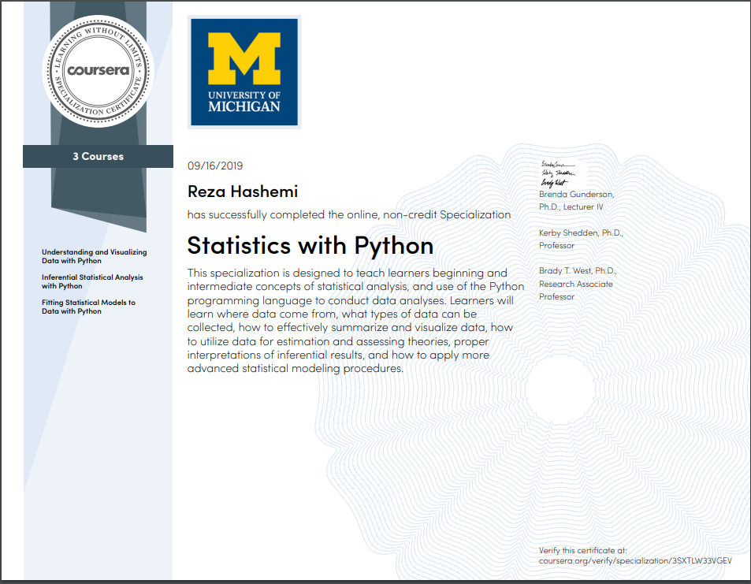

| Name | Description | Date 
| :- |-------------: | :-:
|Reza Hashemi| 💻 University of Michigan Statistics with Python Specialization    | Starts on 23rd of May 2019 |

<h1 align="center">Statistics with Python Specialization 🤖</h1>

Notebooks from University of Michigan Statistics with Python Specialization on Coursera.

--- 

This specialization is designed to teach learners beginning and intermediate concepts of statistical analysis using the Python programming language. Learners will learn where data come from, what types of data can be collected, study data design, data management, and how to effectively carry out data exploration and visualization. They will be able to utilize data for estimation and assessing theories, construct confidence intervals, interpret inferential results, and apply more advanced statistical modeling procedures. Finally, they will learn the importance of and be able to connect research questions to the statistical and data analysis methods taught to them.
