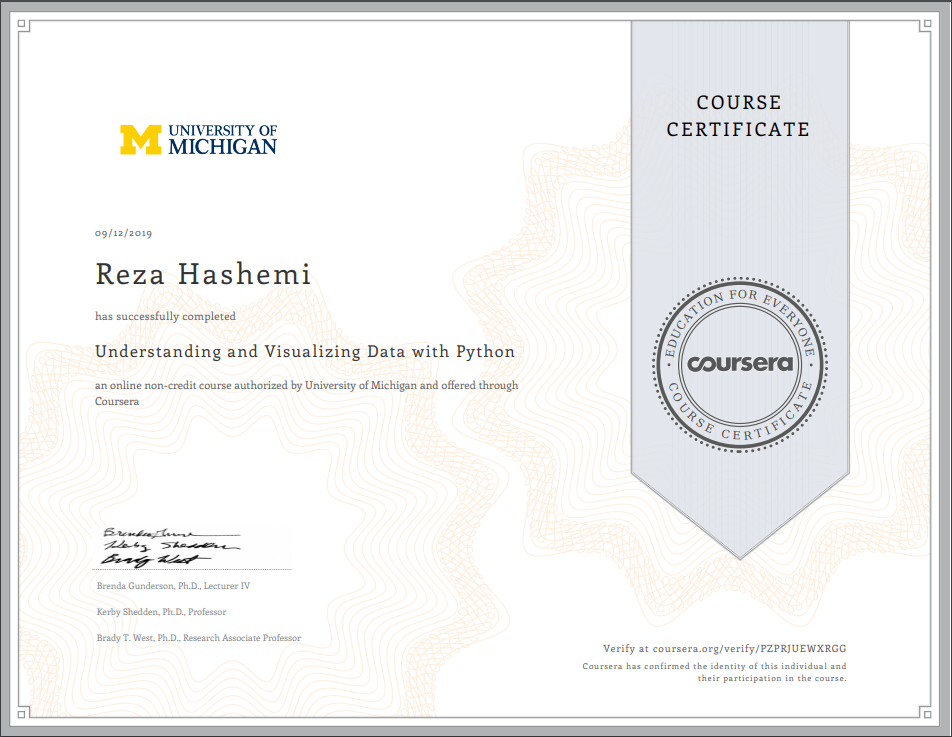

| Name | Description | Date 
| :- |-------------: | :-:
|Reza Hashemi| 🏫 University of Michigan: Understanding and Visualizing 🗠 Data with Python    | September 16th 2019 |

<h1 align="center">🎓 Statistics with Python Specialization.🤖</h1>

Notebooks from University of Michigan Understanding and Visualizing 🗠 Data with Python on Coursera.

--- 

  

  <i class="fa fa-line-chart fa-stack-2x"></i>
  <i class="fa fa-search fa-stack-1x" style="left:25px; top: 8px"></i>

<i class="far fa-chart-bar"></i>

<i class="fas fa-chart-network"></i>
